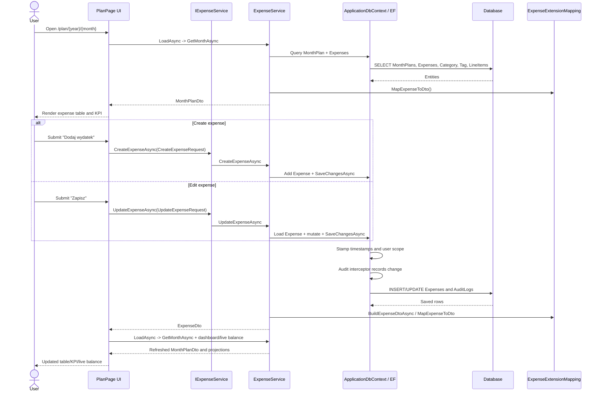
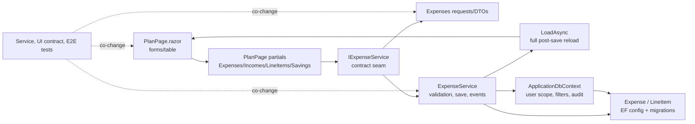

# Research: post-flow-analysis

**Date**: 2026-06-12T20:11:09.6955515+02:00
**Researcher**: Codex
**Git Commit**: 708884d6b9c6af997c60a1ba75ab1f2ec1e2fcf2
**Branch**: main
**Repository**: HouseholdBudgetMate

## Research Question

Przeanalizuj proces zapisu postow, zwracajac szczegolna uwage na powiazane z nim obszary zdefiniowane w `context/map/repo-map.md`. Wykorzystaj trzech rownoleglych sub-agentow: trace e2e, luki w testach, blast radius. Skup sie wylacznie na analizie i opisie stanu obecnego repozytorium.

## Scope Note

W repozytorium nie ma domeny ani encji `Post`/`Posts`. Wyszukiwanie wskazuje, ze polskie "wpisy" w obecnym produkcie oznaczaja wpisy wydatkow w miesiecznym planie. Dlatego raport analizuje aktualny flow `Expense` / `wydatek`: formularz w `PlanPage`, `CreateExpenseAsync` / `UpdateExpenseAsync`, zapis EF, audit/user scope oraz odczyt po zapisie.

## Summary

Flow zapisu wpisu wydatku jest czescia miesiecznego loopa budzetowego, ktory `context/map/repo-map.md` wskazuje jako najaktywniejszy obszar repo: `PlanPage`, `ExpenseService`, kontrakty `Expenses`, EF model/migracje i `ExpenseServiceTests`. Zapis nie konczy sie na lokalnym `INSERT`/`UPDATE`. Po stronie UI glowne create/edit/delete/reorder handlery wracaja przez `LoadAsync`; ast-grep potwierdzil 14 bezargumentowych call-site'ow `await LoadAsync()` i 2 call-site'y `await LoadAsync(bypassPreparation: true)` w partialach `PlanPage`, wiec "pelny reload po kazdym zapisie" trzeba rozumiec jako dominujacy wzorzec, nie absolutna regule.

Najwazniejszy szew techniczny dla badanego przeplywu to podzbior `IExpenseService`: `CreateExpenseAsync`, `UpdateExpenseAsync`, `DeleteExpenseAsync`, line items, copy/suggestions i read methods. Ast-grep potwierdzil, ze sam interfejs ma 32 metody; DTO po zapisie zwracaja create/update expense oraz create/update line item, natomiast delete/reorder sa `Task`, a copy/suggestions zwracaja `int`. `PlanPage` ignoruje zwrocone `ExpenseDto` dla create/update expense i opiera sie na reloadzie.

## Ast-Grep Verification Of Structural Claims

Weryfikacja ponizej uzywa `npx ast-grep run` z lokalnego `@ast-grep/cli` 0.43.0. Linie w wynikach ast-grep sa traktowane jako dowod strukturalny, a referencje ponizej sa podane jako standardowe 1-based file:line.

| Twierdzenie strukturalne z raportu | Wzorzec ast-grep | Wynik |
|---|---|---|
| W repo nie ma domeny/encji `Post` ani `DbSet<Post>`. | `class Post { $$$ }`; `--kind property_declaration` na `ApplicationDbContext.cs` | Potwierdzone. `class Post` nie zwrocil wynikow. Selector property declarations pokazal `DbSet<Expense>` w `src/HouseholdBudgetMate.Migrations/ApplicationDbContext.cs:30`, ale nie pokazal `DbSet<Post>`. |
| Analizowany flow UI ma jeden call-site create expense i jeden call-site update expense w `PlanPage`. | `await ExpenseService.CreateExpenseAsync($$$);`; `await ExpenseService.UpdateExpenseAsync($$$);` | Potwierdzone. Create: `src/HouseholdBudgetMate.Web/Components/Pages/PlanPage/PlanPage.Expenses.cs:124`. Update: `src/HouseholdBudgetMate.Web/Components/Pages/PlanPage/PlanPage.Expenses.cs:211`. Oba sa expression statements, wiec zwrocone `ExpenseDto` nie jest uzyte. |
| Po create/edit expense UI wraca przez `LoadAsync`. | `await LoadAsync();`; `ResetCreateExpenseForm();` | Potwierdzone dla create/edit expense. `ResetCreateExpenseForm()` jest w `PlanPage.Expenses.cs:126`; `await LoadAsync()` po create w `PlanPage.Expenses.cs:127`, po update w `PlanPage.Expenses.cs:213`. |
| "Kazdy zapis robi pelny `LoadAsync`" jako absolutne twierdzenie. | `await LoadAsync();`; `await LoadAsync($ARG);` | Doprecyzowane. Ast-grep znalazl 14 bezargumentowych `await LoadAsync()` oraz 2 `await LoadAsync(bypassPreparation: true)` w `PlanPage.Expenses.cs:446` i `PlanPage.Expenses.cs:482`. Lepiej pisac: dominujacy post-save wzorzec to reload, ale flow propozycji historycznych swiadomie omija preparation. |
| `LoadAsync` w pelnym odczycie wywoluje month plan, dashboard, incomes i live balance. | `ExpenseService.GetMonthAsync($$$)`; `ExpenseService.GetDashboardSummaryAsync($$$)`; `IncomeService.GetMonthIncomesAsync($$$)`; `IncomeService.GetLiveBalanceAsync($$$)` | Potwierdzone. Call-site'y sa pojedyncze i znajduja sie w `src/HouseholdBudgetMate.Web/Components/Pages/PlanPage/PlanPage.Lifecycle.cs:59-63`. |
| `IExpenseService` jako szew zapisu/read flow. | `--kind method_declaration` na `IExpenseService.cs` | Doprecyzowane. Interfejs ma 32 metody. Dla badanego flow szczegolnie istotne sa `GetMonthAsync` (`IExpenseService.cs:8`), `CreateExpenseAsync` (`IExpenseService.cs:33`), `UpdateExpenseAsync` (`IExpenseService.cs:43`), line items (`IExpenseService.cs:37`, `IExpenseService.cs:57`, `IExpenseService.cs:65`) oraz delete/reorder/copy/suggestions (`IExpenseService.cs:47-60`). |
| `CreateExpenseRequest` ma pola wskazane w trace. | `--kind property_declaration` na `CreateExpenseRequest.cs` | Potwierdzone. Ast-grep znalazl 8 properties: `Year`, `Month`, `Name`, `CategoryId`, `TagId`, `PlannedAmount`, `ActualAmount`, `ShowRemainingInUI` w `src/HouseholdBudgetMate.Abstractions/Contracts/Expenses/Requests/CreateExpenseRequest.cs:5-12`. |
| `ExpenseDto` niesie read-back state dla expense. | `--kind property_declaration` na `ExpenseDto.cs` | Potwierdzone i doprecyzowane. Ast-grep znalazl 18 properties/computed properties w `src/HouseholdBudgetMate.Abstractions/Contracts/Expenses/Dto/ExpenseDto.cs:5-22`, w tym `LineItems`, `HasLineItems`, `IsUnplanned`, `RemainingAmount`. |
| EF zapis stempluje user scope/timestamp i filtruje `Expense`. | `--kind invocation_expression` na `ApplicationDbContext.cs` | Potwierdzone. `SaveChangesAsync` wywoluje `UpdateTimestampsAndUserScope()` (`ApplicationDbContext.cs:60-62`); `StampUserScope(ChangeTracker.Entries<Expense>())` i `ExpenseLineItem` sa w `ApplicationDbContext.cs:73-74`; `Expense` query filter jest w `ApplicationDbContext.cs:219`. |
| Audit obejmuje `Expense`, `ExpenseLineItem`, `Income`, `MonthSavingsTransferItem`. | `--kind if_statement` na `AuditSaveChangesInterceptor.cs` | Potwierdzone i doprecyzowane. Auditable guard obejmuje tez `Account`, `AccountMonthBalance`, `Category`, `LoanInstallment`, `RegularExpenseDefinition`, `RegularIncomeDefinition` w `src/HouseholdBudgetMate.Application/Auditing/AuditSaveChangesInterceptor.cs:149-158`. |
| Line-item actual amount jest dzielony miedzy UI parent i mapping. | `_newExpense.ActualAmount = SupportsLineItemsForSelection($$$) ? 0 : $AMOUNT;`; `_editExpense.ActualAmount = SupportsLineItemsForSelection($$$) ? 0 : $AMOUNT;`; `ActualAmount = expense.LineItems.Count > 0 ? expense.LineItems.Sum($$$) : expense.ActualAmount` | Potwierdzone. Create zeruje actual na `PlanPage.Expenses.cs:118-120`, edit na `PlanPage.Expenses.cs:207-209`, a mapping wylicza DTO actual z line items w `src/HouseholdBudgetMate.Application/Mapping/ExpenseExtensionMapping.cs:23`. |
| Save handlery w `PlanPage` maja powtarzalny ksztalt service call + success snackbar + reload. | `await $SERVICE.$METHOD($$$);`; `Snackbar.Add($MSG, Severity.Success);`; `await LoadAsync();` | Doprecyzowane. Ast-grep znalazl 16 success snackbarow i wiele service calls w `PlanPage` partials, ale nie wszystkie maja parse/validate albo reset formularza. Wspolny wzorzec to raczej "service call + snackbar + reload/refresh", nie jednolita implementacja kazdego handlera. |

## Feature Overview

Uzytkownik dodaje wpis wydatku na stronie miesiecznego planu `/plan/{Year}/{Month}`. Strona wstrzykuje `IExpenseService`, ktory DI mapuje na `ExpenseService` (`src/HouseholdBudgetMate.Web/Program.cs:167-172`). Formularz "Nowy wydatek" jest w `src/HouseholdBudgetMate.Web/Components/Pages/PlanPage/PlanPage.razor:1032-1140`; `ActionForm` submituje do `CreateExpenseAsync` na `PlanPage.razor:1046`.

`PlanPage.CreateExpenseAsync` pilnuje, czy miesiac jest edytowalny, parsuje kwoty planowana/realna, zeruje realna kwote dla kategorii obslugiwanych przez line items, ustawia rok/miesiac, wywoluje `ExpenseService.CreateExpenseAsync`, resetuje formularz, wykonuje `LoadAsync` i pokazuje snackbar sukcesu (`src/HouseholdBudgetMate.Web/Components/Pages/PlanPage/PlanPage.Expenses.cs:102-134`).

Po stronie aplikacji `ExpenseService.CreateExpenseAsync` waliduje request, pobiera lub tworzy `MonthPlan`, blokuje zapis dla zamknietego miesiaca, robi snapshot envelope usage, waliduje kategorie/tag, nadaje nastepny `Order`, dodaje `Expense`, zapisuje EF, po zapisie emituje event przekroczenia koperty i buduje `ExpenseDto` (`src/HouseholdBudgetMate.Application/Services/ExpenseService.cs:1706-1771`).

Odczyt po zapisie wraca przez `PlanPage.LoadAsync`, ktory wywoluje `GetMonthAsync`, `GetDashboardSummaryAsync`, `GetMonthIncomesAsync` i `GetLiveBalanceAsync` (`src/HouseholdBudgetMate.Web/Components/Pages/PlanPage/PlanPage.Lifecycle.cs:25-63`). `GetMonthAsync` pobiera `MonthPlan` i `Expenses` z `Category`, `Tag`, `LineItems`, sortuje po `Order` i mapuje encje do DTO (`src/HouseholdBudgetMate.Application/Services/ExpenseService.cs:382-422`). DTO planu dostaje KPI przez `BuildMonthPlanDto` i `CalculateMonthPlanKpi` (`src/HouseholdBudgetMate.Application/Services/ExpenseService.cs:2494-2538`).

Edit flow jest analogiczny: row button odpala `StartEditAsync`, formularz edycji submituje do `SaveEditAsync`, a `SaveEditAsync` parsuje kwoty, wywoluje `UpdateExpenseAsync`, wychodzi z trybu edycji, robi `LoadAsync` i pokazuje sukces (`src/HouseholdBudgetMate.Web/Components/Pages/PlanPage/PlanPage.Expenses.cs:147-219`). Po stronie serwisu update ma dodatkowa galez: jezeli wydatek ma line items, `ActualAmount` jest przeliczane z pozycji, a nie z inputu rodzica.

## E2E Trace

1. Entry route i DI: `PlanPage` przyjmuje `Year`, `Month`, `editExpenseId`, `addExpense` (`src/HouseholdBudgetMate.Web/Components/Pages/PlanPage/PlanPage.razor.cs:19-26`), a `IExpenseService` jest zarejestrowany jako `ExpenseService` (`src/HouseholdBudgetMate.Web/Program.cs:167-172`).
2. Initial load: `OnParametersSetAsync` normalizuje parametry i wywoluje `LoadAsync` (`src/HouseholdBudgetMate.Web/Components/Pages/PlanPage/PlanPage.Lifecycle.cs:9-23`).
3. Lista wpisow: `_monthPlan.Expenses` jest sortowana i filtrowana w `OrderedExpenses`/`FilteredExpenses` (`src/HouseholdBudgetMate.Web/Components/Pages/PlanPage/PlanPage.razor.cs:171-181`) oraz renderowana przez `MudTable Items="FilteredExpenses"` (`src/HouseholdBudgetMate.Web/Components/Pages/PlanPage/PlanPage.razor:697`).
4. Create submit: formularz nowego wydatku (`src/HouseholdBudgetMate.Web/Components/Pages/PlanPage/PlanPage.razor:1044-1140`) trafia do `PlanPage.CreateExpenseAsync` (`src/HouseholdBudgetMate.Web/Components/Pages/PlanPage/PlanPage.Expenses.cs:102`).
5. Contract seam: request ma `Year`, `Month`, `Name`, `CategoryId`, `TagId`, `PlannedAmount`, `ActualAmount`, `ShowRemainingInUI` (`src/HouseholdBudgetMate.Abstractions/Contracts/Expenses/Requests/CreateExpenseRequest.cs:3-13`); interfejs wystawia `CreateExpenseAsync` (`src/HouseholdBudgetMate.Abstractions/Interfaces/IExpenseService.cs:33`).
6. Validation: `CreateExpenseRequestValidator` trimuje `Name`, wymaga kategorii, poprawnego tagu i nieujemnych kwot (`src/HouseholdBudgetMate.Application/Validation/Expenses/ExpenseRequestValidators.cs:49-92`).
7. Persistence: `ExpenseService.CreateExpenseAsync` tworzy `Expense` i wywoluje `SaveChangesAsync` (`src/HouseholdBudgetMate.Application/Services/ExpenseService.cs:1740-1756`).
8. EF side effects: `ApplicationDbContext.SaveChangesAsync` stempluje timestampy i user scope (`src/HouseholdBudgetMate.Migrations/ApplicationDbContext.cs:59-80`), a query filters ograniczaja `Expense` do obecnego budget ownera i nieusunietych rekordow (`src/HouseholdBudgetMate.Migrations/ApplicationDbContext.cs:213-230`).
9. Audit: `AuditSaveChangesInterceptor` traktuje `Expense`, `ExpenseLineItem`, `Income` i `MonthSavingsTransferItem` jako auditable entries (`src/HouseholdBudgetMate.Application/Auditing/AuditSaveChangesInterceptor.cs:147-168`).
10. Read-back: po zapisie `PlanPage` robi pelny `LoadAsync`; `GetMonthAsync` odczytuje z EF i mapuje do `ExpenseDto` przez `MapExpenseToDto` (`src/HouseholdBudgetMate.Application/Mapping/ExpenseExtensionMapping.cs:8-31`).

## Test Coverage And Gaps

| Area | Covered today | Missing / weak branches |
|---|---|---|
| UI create/edit handlers | Source-level UI contract test checks `PlanPage` wiring and expected strings (`src/HouseholdBudgetMate.Tests/Tests/Ui/MonthlyBudgetingLoopUiTests.cs:13-77`). Playwright creates an expense through the real UI and sees it in the month plan (`e2e/seed.spec.ts:3-38`). Cross-screen Playwright creates/edits and verifies Plan, Dashboard, Accounts, Statistics (`e2e/cross-screen-monthly-consistency.spec.ts:11-69`). | No bUnit/behavioral component test clicks `PlanPage` create/edit save and asserts parse failure, snackbar success/error, closed-month guard, form reset, `LoadAsync` invocation, preparation early return, `EditExpenseId`, `AddExpense`, `_isLoading` finalization. |
| Service create | Tests cover budget-exceeded event emission (`src/HouseholdBudgetMate.Tests/Tests/Services/ExpenseServiceTests.cs:118-167`), negative amounts (`src/HouseholdBudgetMate.Tests/Tests/Services/ExpenseServiceTests.cs:173-197`), child subtag persistence (`src/HouseholdBudgetMate.Tests/Tests/Services/ExpenseServiceTests.cs:459-500`), order assignment (`src/HouseholdBudgetMate.Tests/Tests/Services/ExpenseServiceTests.cs:675-712`), closed month rejection (`src/HouseholdBudgetMate.Tests/Tests/Services/ExpenseServiceTests.cs:1388-1410`), no event under limit (`src/HouseholdBudgetMate.Tests/Tests/Services/ExpenseServiceTests.cs:3659-3687`). | Missing create tests for missing category, missing tag, tag from another category, no-envelope category branch, and event branch where the envelope was already exceeded before this save. |
| Service update | Tests cover negative amounts (`src/HouseholdBudgetMate.Tests/Tests/Services/ExpenseServiceTests.cs:203-235`), child subtag update (`src/HouseholdBudgetMate.Tests/Tests/Services/ExpenseServiceTests.cs:507-570`), not found (`src/HouseholdBudgetMate.Tests/Tests/Services/ExpenseServiceTests.cs:3145-3157`) and additional update persistence/closed-month branches later in the same file. | Missing update tests for invalid category/tag branches and for line-item parent semantics where parent `ActualAmount` input is ignored/recomputed from `ExpenseLineItems`. |
| Read after save | `MonthlyBudgetingLoopTests` exercises create/update and reads loop state after each save (`src/HouseholdBudgetMate.Tests/Tests/Services/MonthlyBudgetingLoopTests.cs:25-132`). `GetMonthAsync` and KPI behavior are covered through service tests and loop assertions. | UI post-save render is covered by Playwright but not by a fast component-level PlanPage test; savings transfer ordering and `BuildExpenseDtoAsync` category/tag override behavior are not directly targeted. |
| Cross-screen projections | Playwright verifies the edited expense is visible on Plan, Dashboard, Accounts, and Statistics (`e2e/cross-screen-monthly-consistency.spec.ts:43-69`). Service tests cover dashboard/statistics projections through `ExpenseServiceTests` and `MonthlyBudgetingLoopTests`. | Most projection coverage is service-level or E2E; there is little mid-level UI component coverage for the actual `PlanPage` refresh after save. |

## Blast Radius

Static graph and co-change history both show that changing this flow normally touches more than one file.

| Layer | Files / seams to inspect when changing the flow |
|---|---|
| UI save handlers | `src/HouseholdBudgetMate.Web/Components/Pages/PlanPage/PlanPage.Expenses.cs:102`, `src/HouseholdBudgetMate.Web/Components/Pages/PlanPage/PlanPage.Expenses.cs:191`, plus sibling post-save patterns in `PlanPage.Incomes.cs`, `PlanPage.SavingsTransfers.cs`, `PlanPage.LineItems.cs`. |
| Post-save reload | `src/HouseholdBudgetMate.Web/Components/Pages/PlanPage/PlanPage.Lifecycle.cs:25-63` and dirty reset at `src/HouseholdBudgetMate.Web/Components/Pages/PlanPage/PlanPage.Lifecycle.cs:93`. |
| Interface seam | `src/HouseholdBudgetMate.Abstractions/Interfaces/IExpenseService.cs:8-72`; create/update expense and line-item methods return DTOs, while delete/reorder return `Task` and copy/suggestions return `int`. `PlanPage` currently discards returned `ExpenseDto` for create/update expense and reloads. |
| Contracts / DTOs | `CreateExpenseRequest`, `UpdateExpenseRequest`, `ExpenseDto`, `ExpenseLineItemDto`, `MonthPlanDto`, KPI DTOs under `src/HouseholdBudgetMate.Abstractions/Contracts/Expenses/`. |
| Application service | `src/HouseholdBudgetMate.Application/Services/ExpenseService.cs:1706-1771`, `src/HouseholdBudgetMate.Application/Services/ExpenseService.cs:2228` for update, line-item methods around `src/HouseholdBudgetMate.Application/Services/ExpenseService.cs:2026`. |
| Validation / mapping | `src/HouseholdBudgetMate.Application/Validation/Expenses/ExpenseRequestValidators.cs:49-133`, `src/HouseholdBudgetMate.Application/Mapping/ExpenseExtensionMapping.cs:8-31`. |
| Domain / EF | `src/HouseholdBudgetMate.Domain/Entities/Expense.cs:5-28`, `src/HouseholdBudgetMate.Domain/EntityConfiguration/ExpenseConfiguration.cs:41-70`, `src/HouseholdBudgetMate.Migrations/ApplicationDbContext.cs:27-31`, `src/HouseholdBudgetMate.Migrations/Migrations/ApplicationDbContextModelSnapshot.cs`. |
| Side effects | User scope/timestamps in `src/HouseholdBudgetMate.Migrations/ApplicationDbContext.cs:59-80`; query filters in `src/HouseholdBudgetMate.Migrations/ApplicationDbContext.cs:213-230`; audit in `src/HouseholdBudgetMate.Application/Auditing/AuditSaveChangesInterceptor.cs:147-168`; budget exceeded event from `ExpenseService.CreateExpenseAsync`. |
| Tests | `src/HouseholdBudgetMate.Tests/Tests/Services/ExpenseServiceTests.cs`, `src/HouseholdBudgetMate.Tests/Tests/Services/MonthlyBudgetingLoopTests.cs`, `src/HouseholdBudgetMate.Tests/Tests/Ui/MonthlyBudgetingLoopUiTests.cs`, `e2e/seed.spec.ts`, `e2e/cross-screen-monthly-consistency.spec.ts`. |

Co-change evidence from git since 2026-04-02:

- `PlanPage` and `ExpenseService.cs` co-changed in 18 commits.
- `82cbb36 feat(planning): improve monthly planning` changed `IExpenseService`, expense DTO/request contracts, `ExpenseService`, validators, domain/migration/snapshot, service/UI tests and `PlanPage.*`.
- `2c3409c dirty check` changed save-handler partials, `PlanPage.Lifecycle.cs`, dirty tracking, `ExpenseService`, `IncomeService`, service tests and UI tests.
- `34d0806 income and code refator` introduced/changed income contracts/service, month savings transfer contracts/entity/config/migrations, mappings, `IIncomeService`, `IExpenseService`, tests and `PlanPage`.
- `f19ab69 PlanPage refactor` split `PlanPage` into partials while also touching `ExpenseService`, `ExpenseServiceTests`, `Program.cs` and generated installer output. Generated installer output should be treated as packaging noise unless the publish/build surface changes.

## Technical Debt

1. `PlanPage` uses a coarse post-save reload as its dominant refresh mechanism. This keeps the page consistent, but most create/edit/delete/reorder paths refresh many unrelated concerns: categories, tag usage, accounts, month plan, dashboard summary, incomes, live balance, chart/KPI state, query-driven edit state and dirty state (`src/HouseholdBudgetMate.Web/Components/Pages/PlanPage/PlanPage.Lifecycle.cs:31-93`). Ast-grep found 14 `await LoadAsync()` calls and 2 `await LoadAsync(bypassPreparation: true)` calls, so future changes should preserve the deliberate bypass cases. The service returns `ExpenseDto` for create/update expense, but the UI ignores it (`src/HouseholdBudgetMate.Web/Components/Pages/PlanPage/PlanPage.Expenses.cs:124-128`, `src/HouseholdBudgetMate.Web/Components/Pages/PlanPage/PlanPage.Expenses.cs:211-213`).
2. UI save behavior is duplicated across multiple partials, but not as one perfectly identical template. Expense, income, savings transfer and line-item handlers repeat a family resemblance: service call, success/error snackbar, local state cleanup and `LoadAsync`/refresh. Some paths parse amounts and reset forms, while copy/suggestion/month close-open paths have different preconditions and `LoadAsync(bypassPreparation: true)` variants. Any semantic change to post-save behavior risks drift across partial files.
3. There is no literal `Post` domain vocabulary. Product/UI text says "wpis" in places, while code speaks `Expense`. That is workable in this budget app, but future planning should name the concept precisely to avoid searching the wrong aggregate.
4. Test coverage is strong at service and E2E ends, but thin in the middle. There is no fast component-level test for actual `PlanPage` create/edit interactions and post-save render refresh. Current UI tests are mostly static source checks plus small rendered smoke hosts.
5. Line-item semantics are split between parent `Expense.ActualAmount` and derived DTO actual amount. UI zeroes actual amount for line-item-capable selections (`src/HouseholdBudgetMate.Web/Components/Pages/PlanPage/PlanPage.Expenses.cs:117-120`), while mapping returns the sum of line items when present (`src/HouseholdBudgetMate.Application/Mapping/ExpenseExtensionMapping.cs:22-24`). This is intentional but fragile unless protected by explicit tests.
6. Save side effects are implicit. `ExpenseService` does not set `UserId`/timestamps directly; `ApplicationDbContext` does it during `SaveChangesAsync` (`src/HouseholdBudgetMate.Migrations/ApplicationDbContext.cs:59-80`). Audit logs are interceptor-driven. Batching, skipping, or rearranging saves can therefore change user scope, timestamps and audit shape.
7. Model/migration changes are a high-noise blast radius. Pure flow changes should avoid domain/migration edits; persisted semantic changes must update entities, EF configs, migrations and `ApplicationDbContextModelSnapshot` together.

## Architecture Insights

- The repo follows the documented layering: UI calls application services; services use `IDbContextFactory<ApplicationDbContext>`; UI receives DTOs from `HouseholdBudgetMate.Abstractions`, not domain entities.
- `ExpenseService` is a broad application service. It owns save behavior, monthly plan creation, KPI inputs, recurring expense sync, line-item behavior, dashboard/statistics data and budget-exceeded events.
- `PlanPage` is split into partials, but the runtime feature is one large stateful component. `LoadAsync` is the central post-save consistency mechanism.
- `context/map/repo-map.md` correctly identifies `PlanPage` + `ExpenseService` + expense contracts/tests as the hot path. The git co-change history confirms this better than a JS dependency graph would.

## Historical Context

- `context/map/repo-map.md` identifies monthly planning as the main active area and warns that real coupling is in C#/Razor, DI, JS interop and git co-change rather than JS imports.
- `context/archive/2026-06-03-improve-monthly-planning/research.md` and related evidence describe recent changes around monthly planning, suggestions and accepted financial indicators.
- `context/archive/2026-05-29-verify-monthly-safe-to-spend-loop/acceptance-evidence.md` records cross-screen live-balance/plan-KPI verification after edit.
- `context/archive/2026-05-26-align-safe-to-spend-contract/` contains prior work around the financial result contract that shaped current dashboard/plan naming.

## Code References

- `src/HouseholdBudgetMate.Web/Components/Pages/PlanPage/PlanPage.razor:1032` - create expense anchor/form area.
- `src/HouseholdBudgetMate.Web/Components/Pages/PlanPage/PlanPage.Expenses.cs:102` - create expense UI handler.
- `src/HouseholdBudgetMate.Web/Components/Pages/PlanPage/PlanPage.Expenses.cs:191` - save edit UI handler.
- `src/HouseholdBudgetMate.Web/Components/Pages/PlanPage/PlanPage.Lifecycle.cs:25` - post-save/read reload hub.
- `src/HouseholdBudgetMate.Abstractions/Interfaces/IExpenseService.cs:33` - create expense service contract.
- `src/HouseholdBudgetMate.Abstractions/Contracts/Expenses/Requests/CreateExpenseRequest.cs:3` - create request shape.
- `src/HouseholdBudgetMate.Abstractions/Contracts/Expenses/Dto/ExpenseDto.cs:3` - returned expense DTO.
- `src/HouseholdBudgetMate.Application/Services/ExpenseService.cs:1706` - application create method.
- `src/HouseholdBudgetMate.Application/Services/ExpenseService.cs:382` - month read method after save.
- `src/HouseholdBudgetMate.Application/Mapping/ExpenseExtensionMapping.cs:8` - entity-to-DTO mapping.
- `src/HouseholdBudgetMate.Domain/Entities/Expense.cs:5` - persisted expense aggregate record.
- `src/HouseholdBudgetMate.Domain/EntityConfiguration/ExpenseConfiguration.cs:41` - EF relationships/indexes.
- `src/HouseholdBudgetMate.Migrations/ApplicationDbContext.cs:59` - save-time timestamp/user-scope stamping.
- `src/HouseholdBudgetMate.Application/Auditing/AuditSaveChangesInterceptor.cs:147` - auditable entity list.
- `src/HouseholdBudgetMate.Tests/Tests/Services/ExpenseServiceTests.cs:118` - budget exceeded event coverage.
- `src/HouseholdBudgetMate.Tests/Tests/Services/MonthlyBudgetingLoopTests.cs:25` - service-level monthly loop coverage.
- `e2e/seed.spec.ts:3` - E2E create expense smoke.
- `e2e/cross-screen-monthly-consistency.spec.ts:11` - E2E cross-screen create/edit/read visibility.

## Related Research

- `context/map/repo-map.md`
- `context/archive/2026-06-03-improve-monthly-planning/research.md`
- `context/archive/2026-06-02-testing-cross-screen-monthly-consistency/research.md`
- `context/archive/2026-05-29-verify-monthly-safe-to-spend-loop/acceptance-evidence.md`
- `context/archive/2026-05-26-align-safe-to-spend-contract/`

## Open Questions

- Czy przyszly naming ma zostac przy "Expense/wydatek", czy produktowo pojecie "wpis" ma oznaczac szerszy typ transakcji obejmujacy expense, income, line item i savings transfer?
- Czy `PlanPage` ma zachowac pelny reload po kazdym zapisie, czy docelowo potrzebny jest mniejszy post-save contract zwracajacy od razu odswiezone KPI/live balance/dashboard fragments?
- Czy line-item parent actual amount powinien miec dodatkowy test kontraktowy, zeby utrwalic zasade "parent actual amount jest ignorowany, kiedy sa line items"?
