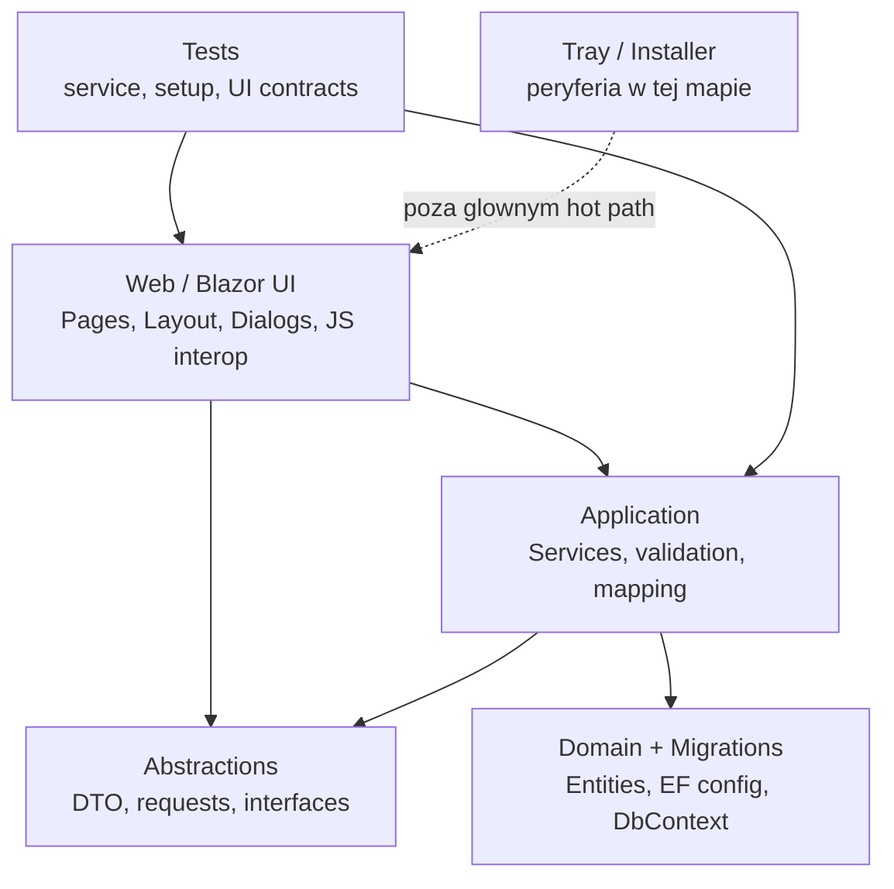
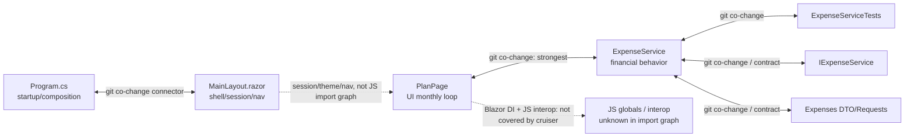

# Repo Map

Data: mapa laczy trzy istniejace artefakty z `context/map/` i opisuje aktywnosc oraz strukture repo w oknie 1 roku. Efektywna historia w repo zaczyna sie 2026-04-02, wiec praktyczne wnioski obejmuja okres 2026-04-02 - 2026-06-09.

## TL;DR

Household Budget Mate to aplikacja .NET/Blazor Server do planowania budzetu domowego, z wyraznym podzialem na kontrakty, domena/migracje, serwisy aplikacyjne, UI webowe, testy oraz poboczne projekty tray/installer. Realny ciezar pracy w ostatnim oknie skupia sie nie na calym drzewie `src/`, tylko na miesiecznym loopie budzetowym: `PlanPage`, `ExpenseService`, kontrakty wydatkow i `ExpenseServiceTests`. Drugim centrum aktywnosci sa elementy laczace aplikacje: `Program.cs`, `MainLayout.razor`, strony `Accounts`, `Home`, `Statistics`; ostatni widoczny epizod to backup/restore i admin safety. Dependency-cruiser pokazal prawie pusty graf importow JS, ale to nie oznacza braku powiazan: wiekszosc realnych zaleznosci siedzi w C#/Razor, DI, JS interop, globalach przegladarki i historii wspolnych zmian. Najwiekszy bol to szerokie komponenty UI agregujace serwisy, stan sesji, nawigacje, dialogi i JS runtime. Ownership w analizowanych obszarach jest praktycznie jednoosobowy: po odfiltrowaniu botow i agentow support tematyczny prowadzi do Kamila Swiderskiego.

## Teren

Najwieksza odpowiedzialnosc operacyjna lezy w `src/HouseholdBudgetMate.Web`, `src/HouseholdBudgetMate.Application`, `src/HouseholdBudgetMate.Abstractions` i `src/HouseholdBudgetMate.Tests`. `Domain` oraz `Migrations` sa wazne dla modelu danych, ale w mapie aktywnosci mocniej pojawiaja sie jako zaplecze dla serwisow niz samodzielny hot spot. `Tray` i `Installer` sa peryferyjne dla tej mapy: istnieja w repo, ale trzy artefakty nie wskazuja ich jako glownego obszaru ostatniej aktywnosci.

Glebokie moduly to te, ktore lacza decyzje finansowe z UI i testami: `ExpenseService`, `IExpenseService`, kontrakty wydatkow, `PlanPage` oraz `ExpenseServiceTests`. Zmiana w jednym z nich czesto oznacza zmiane semantyki miesiecznego planowania, nie tylko lokalna poprawke pliku. Plytsze albo bardziej izolowane wnioski dotycza JS: dependency-cruiser widzi tylko cztery moduly JS i zero importow, wiec ich brak krawedzi oznacza `unknown` dla realnych powiazan Blazor/DOM, a nie dowod izolacji.

Aktywnosc w czasie przesuwa sie falami. Start historii repo to szeroka praca nad fundamentami, kategoriami i wydatkami; potem blok kredytow; od polowy kwietnia wydatki i planowanie miesieczne; od 2026-05-18 access/setup/admin safety; poczatek czerwca znowu monthly planning; tydzien 2026-06-08 dominuje backup/restore. Struktura katalogow sugeruje warstwy, ale realna aktywnosc przecina je przez user-facing flow: `PlanPage` w UI, `ExpenseService` w aplikacji, kontrakty w `Abstractions` i testy uslugowe zmieniaja sie razem.

## Realne Powiazania

Najsilniejsze sprzezenie z historii gita to `Application/Services/ExpenseService` + `Web/Components/Pages/PlanPage`. Wiemy to z kozmiennosci commitow w `artifact-1-territory.md`, nie z grafu importow. Oznacza to, ze miesieczne planowanie jest silnie zalezne od semantyki wydatkow i safe-to-spend.

`ExpenseService` + `ExpenseServiceTests` oraz trojka `ExpenseService` + `ExpenseServiceTests` + `PlanPage` wygladaja jak zdrowe, ale kosztowne sprzezenie: zmiana zachowania finansowego czesto wymaga korekty testow i UI. Zrodlo: historia gita. To jest reczna koedycja, nie tania regeneracja.

`IExpenseService`, DTO/requesty wydatkow i `ExpenseService` zmieniaja sie razem, co wskazuje na sprzezenie kontraktowe miedzy UI, serwisem i definicjami finansowymi. Zrodlo: historia gita. Przy zmianie kontraktu najpierw sprawdzic kompatybilnosc DTO/requestow oraz widoki, ktore prezentuja wynik finansowy.

`Program.cs` i `MainLayout.razor` sa plikami-lacznikami wielu obszarow. Zrodlo: historia gita, liczba roznych obszarow wspolwystepujacych z tymi plikami. To nie jest klasyczny cykl importow, tylko globalna kompozycja aplikacji: setup, sesja, nawigacja, cookies/theme, admin/readiness gates.

JS nie pokazuje cykli ani zaleznosci w dependency-cruiserze. Zrodlo: graf importow dla `Components` i `wwwroot/js`. To daje tylko waska informacje: brak krawedzi importow JS/TS. Powiazania przez `window`, `document`, `Blazor`, `Chart`, `DataTransfer`, `IJSRuntime`, Razor i DI sa `unknown` dla tego narzedzia.

EF migration designer/snapshot oraz generowane pliki instalatora byly odfiltrowane jako szum. Jesli zmieniaja sie razem z kodem, to nalezy traktowac je jako sprzezenie przez regeneracje, a nie taki sam koszt jak reczna edycja logiki. To wazne przy ocenie ryzyka: wygenerowany snapshot moze byc glosny w diffie, ale nie musi oznaczac dodatkowego ownershipu.

## Strefy Ryzyka

| Strefa | Dlaczego |
|---|---|
| `Web/Components/Pages/PlanPage` | Najaktywniejszy obszar, laczy wiele serwisow, stan miesiecznego loopa, nawigacje, dialogi, snackbar i JS interop. |
| `Application/Services/ExpenseService.cs` | Najczesciej zmieniany plik i centrum semantyki wydatkow/safe-to-spend; zmiany promieniuja na UI, kontrakty i testy. |
| `Abstractions` dla wydatkow | DTO/requesty/interfejsy sa kontraktem miedzy warstwami; mala zmiana pola moze ruszyc UI, testy i definicje finansowe. |
| `Web/Program.cs` + `MainLayout.razor` | Globalna kompozycja aplikacji, sesja, PIN/admin/readiness, theme/cookies i nawigacja; wysoka liczba wspolwystepujacych obszarow. |
| Backup/restore i admin safety | Ostatni aktywny epizod, laczy UI, file input/drag-drop/download przez JS, sesje i integralnosc danych. |
| Charts/JS interop | Graf importow pokazuje zero zaleznosci, ale realne powiazania ida przez globale `window.HBM.charts`, `Chart` i `IJSRuntime`, czyli sa niewidoczne dla cruisera. |

## Kogo Zapytac

| Strefa | Kandydaci | Kontekst pytania |
|---|---|---|
| Monthly planning: `PlanPage` + `ExpenseService` | Kamil Swiderski | Semantyka safe-to-spend, archiwalne miesiace, flow planowania, testy wydatkow, mobile UX. |
| Kontrakty wydatkow | Kamil Swiderski | Definicje DTO/requestow, `LiveBalanceDto`, pola wynikow finansowych, kompatybilnosc UI z kontraktem. |
| Shell/startup/admin access | Kamil Swiderski | `Program.cs`, `MainLayout.razor`, sesja, PIN-gated access, readiness/admin gates, cookies/theme, LAN/Docker setup. |
| Backup/restore | Kamil Swiderski | Format backupu, restore workflow, folder picker, drag/drop, file input i admin safeguards. |
| Accounts/Home/Statistics/Charts | Kamil Swiderski | KPI, salda, statystyki per kategoria, wykresy, dark mode, spojna prezentacja danych finansowych. |

W badanym zakresie nie ma drugiego niezaleznego ludzkiego ownera dla tych stref. Wpisy `Co-Authored-By` z narzedziem AI sa traktowane jako wspomaganie autora, nie osobny kontakt.

## Pierwszy Dzien

1. `context/foundation/prd.md` - produktowy sens aplikacji i granice tego, co system ma robic.
2. `context/foundation/architecture/architecture-guide.md` - zasady warstw, przeplyw zaleznosci i lokalne konwencje.
3. `src/HouseholdBudgetMate.Web/Components/Pages/PlanPage/PlanPage.razor` - glowny user-facing monthly budgeting loop.
4. `src/HouseholdBudgetMate.Application/Services/ExpenseService.cs` - centrum logiki wydatkow i safe-to-spend.
5. `src/HouseholdBudgetMate.Abstractions/Interfaces/IExpenseService.cs` oraz `src/HouseholdBudgetMate.Abstractions/Contracts/Expenses/` - kontrakt miedzy UI i logika aplikacyjna.
6. `src/HouseholdBudgetMate.Tests/Tests/Services/ExpenseServiceTests.cs` - najblizsza siatka bezpieczenstwa dla logiki wydatkow.
7. `src/HouseholdBudgetMate.Web/Program.cs` i `src/HouseholdBudgetMate.Web/Components/Layout/MainLayout.razor` - kompozycja aplikacji, shell, sesja i globalne zachowania.
8. `src/HouseholdBudgetMate.Web/Components/Pages/AdminBackup.razor` oraz `src/HouseholdBudgetMate.Web/wwwroot/js/backup-drop-zone.js` - aktualny obszar backup/restore i przyklad powiazan UI z JS interop.

## Ograniczenia

To jest mapa aktywnosci i struktury z okna 1 roku, ale efektywne dane w tym repo obejmuja 2026-04-02 - 2026-06-09. Nie jest to kompletna dokumentacja architektury ani pelny graf zaleznosci calego systemu.

Metoda laczy trzy zrodla: kozmiennosc z historii gita, ograniczony graf importow `dependency-cruiser` dla aktywnych zrodel webapp/JS oraz mape kontrybutorow z ostatnich tygodni. Coupling z gita mowi, co bylo zmieniane razem, ale nie dowodzi przyczyny. Graf importow mowi tylko o JS/TS widocznym dla cruisera; dla C#/Razor, DI, globali przegladarki, JS interop i platformowych typow przegladarki wiele powiazan ma status `unknown`, nie "brak powiazan".

Mapa nie mierzy liczby linii, runtime performance, produkcyjnych incydentow, pokrycia testami ani jakosci UX. Odfiltrowane pliki generowane, migracyjne snapshoty, build outputy i konfiguracje nie powinny byc interpretowane jako reczna aktywnosc produktowa. Jesli zmieniaja sie przez regeneracje albo mockowanie, jest to tanszy rodzaj sprzezenia niz reczna koedycja logiki i powinien byc wazony inaczej przy planowaniu kosztu zmiany.
